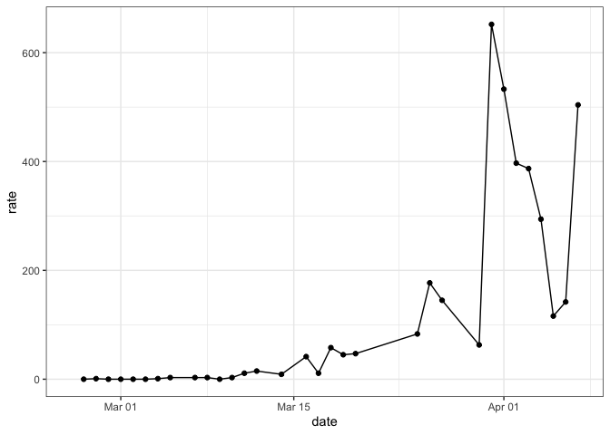

## Obtenção de Dados

Afim de simplificar o acesso aos dados, utilizou-se o pacote [`datacovidbr`](https://github.com/Freguglia/datacovidbr), que importa diariamente os dados compilados pela iniciativa [Brasil IO](http://www.brasil.io), sem maiores dependências. Para que colaboradores que não utilizam o R como plataforma analítica, o arquivo `dados/covid19_cidades.csv` possui os dados (por cidade) disponíveis hoje (Tue Apr  7 18:50:11 2020).


```r
library(datacovidbr)
library(tidyverse)
library(lubridate)
datapath = "dados"
covid19_cidades = brasilio() %>% filter(place_type == 'city')
write_csv(covid19_cidades, file.path(datapath, "covid19_cidades.csv"))
write_csv(covid19_cidades, file.path(datapath, paste0("covid19_cidades-", today(), ".csv")))
save(covid19_cidades, file=file.path(datapath, "covid19_cidades.rda"))
save(covid19_cidades, file=file.path(datapath, paste0("covid19_cidades-", today(), ".rda")))
```

## Manipulação de dados

Abaixo, são apresentados dados da cidade de São Paulo, apenas por esta ter sido a cidade onde foi identificado o paciente zero do Brasil e haver um histórico maior de informações, que podem ser úteis para a modelagem de casos e óbitos.


```r
casos_sp = covid19_cidades %>% filter(city == "São Paulo") %>% 
  select(-state, -place_type, -is_last, -city_ibge_code)
# casos_sp = casos_sp %>% mutate(confirmed=case_when(
#   date == as.Date("2020-03-24") ~ as.integer(717),
#  TRUE ~ confirmed))
casos_sp %>% head() %>% knitr::kable("markdown")
```


|date       |city      | confirmed| deaths| estimated_population_2019| confirmed_per_100k_inhabitants| death_rate|
|:----------|:---------|---------:|------:|-------------------------:|------------------------------:|----------:|
|2020-04-06 |São Paulo |      3754|    244|                  12252023|                       30.63984|     0.0650|
|2020-04-05 |São Paulo |      3612|    220|                  12252023|                       29.48085|     0.0609|
|2020-04-04 |São Paulo |      3496|    212|                  12252023|                       28.53406|     0.0606|
|2020-04-03 |São Paulo |      3202|    186|                  12252023|                       26.13446|     0.0581|
|2020-04-02 |São Paulo |      2815|    164|                  12252023|                       22.97580|     0.0583|
|2020-04-01 |São Paulo |      2418|    144|                  12252023|                       19.73552|     0.0596|

```r
casos_sp %>% select(date, confirmed, deaths) %>% gather(type, counts, -date) %>% 
  ggplot(aes(date, counts, colour=type)) + geom_point() + geom_line() + scale_y_log10() +
  theme_bw() + xlab("Data") + ylab("Contagem") +
  ggtitle("Casos Confirmados e Óbitos na Cidade de São Paulo")
```

<!-- -->

## Taxas de Mudança


```r
temp = casos_sp %>% select(date, confirmed, deaths) %>% arrange(date) %>% 
  mutate(dx=as.integer(date-lag(date, default=date[1])),
         dconf=confirmed-lag(confirmed, default=confirmed[1]),
         rate = dconf/dx)
ggplot(temp, aes(date, rate)) + geom_line() + geom_point() +
  theme_bw()
```

```
## Warning: Removed 1 row(s) containing missing values (geom_path).
```

```
## Warning: Removed 1 rows containing missing values (geom_point).
```

<!-- -->


## Contato

Para maiores informações, utilize a plataforma [https://covid.ic.unicamp.br/](https://covid.ic.unicamp.br/). Em particular, procuramos documentar informações desta inciativa no seu respectivo tópico em Modelagem e Epidemiologia ([https://covid.ic.unicamp.br/c/tecnolC3B3gicas/ModelagemeEpidemiologia/11](https://covid.ic.unicamp.br/c/tecnolC3B3gicas/ModelagemeEpidemiologia/11)).
